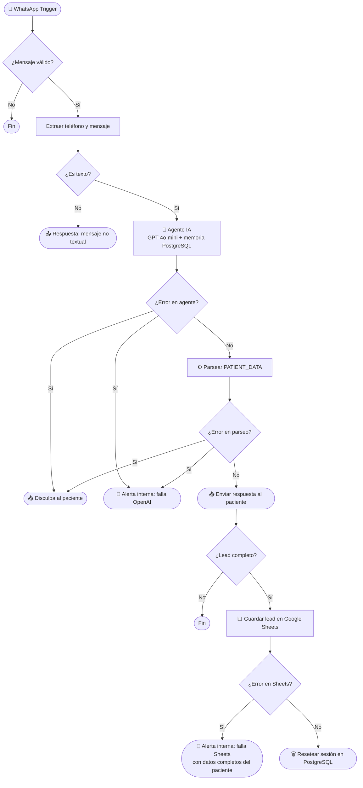

# ClinicBot — Agente Conversacional de WhatsApp para Clínicas Privadas

> Calificación automática de pacientes y atención de consultas frecuentes vía WhatsApp, construido con n8n, GPT-4o-mini y PostgreSQL.

---

## Descripción

ClinicBot es una automatización de WhatsApp lista para producción que gestiona consultas entrantes de pacientes para clínicas privadas. Responde preguntas frecuentes, califica pacientes recopilando datos clave de ingreso y deriva a un agente humano cuando la situación lo requiere — todo con memoria de conversación persistente entre sesiones.

Desarrollado como prueba de concepto white-label orientada al sector salud privado en Argentina, ClinicBot está diseñado para ser configurable y desplegable en cualquier clínica con cuenta de WhatsApp Business.

---

## Stack tecnológico

| Capa | Tecnología |
|---|---|
| Motor de automatización | n8n (self-hosted) |
| Mensajería | WhatsApp Business API (Meta) |
| Modelo de IA | GPT-4o-mini (OpenAI) |
| Memoria conversacional | PostgreSQL |
| Almacenamiento de leads | Google Sheets |
| Infraestructura | Docker / VPS |

---

## Arquitectura del flujo



---

## Funcionalidades principales

**Respuesta a preguntas frecuentes**
Responde con precisión consultas habituales: horarios de atención, especialidades, dirección, obras sociales aceptadas y política de aranceles. Para consultas fuera de su base de conocimiento, deriva al teléfono de la clínica.

**Calificación de pacientes**
Recopila cuatro campos de ingreso a través de una conversación natural — sin comportamiento de formulario:
- Nombre completo
- Motivo de consulta
- Obra social o prepaga (o si es particular)
- Tipo de atención: urgente o turno programado

Una vez obtenidos los cuatro campos, el agente genera un bloque estructurado `PATIENT_DATA` que el flujo parsea y almacena en Google Sheets.

**Derivación a humano**
El agente deriva inmediatamente cuando detecta síntomas de emergencia, solicitud de hablar con un médico, preguntas sobre diagnósticos o tratamientos en curso, o señales de angustia emocional.

**Memoria de sesión**
El contexto de conversación se almacena por número de teléfono en PostgreSQL con una ventana de 20 mensajes. Una vez que el paciente es calificado, la sesión se resetea automáticamente para que la próxima conversación comience limpia.

---

## Sistema de fallbacks

ClinicBot incluye un sistema de cinco capas de fallback diseñado para la confiabilidad que exige el sector salud — donde el silencio nunca es una respuesta aceptable.

| Escenario | El paciente recibe | El equipo recibe |
|---|---|---|
| Mensaje no textual (audio, imagen, etc.) | Aviso amigable + teléfono de la clínica | Nada |
| Falla en la API de OpenAI | Disculpa + aviso de derivación a humano | Alerta por WhatsApp con teléfono del paciente |
| Output vacío o malformado del agente | Disculpa + aviso de derivación a humano | Alerta por WhatsApp con teléfono del paciente |
| PostgreSQL no disponible | Transparente — la conversación continúa sin memoria | Nada |
| Falla al guardar en Google Sheets | Nada (el paciente ya fue calificado) | Alerta por WhatsApp con datos completos para carga manual |

**Detalles de implementación:**
- AI Agent: `retryOnFail: true` (3 intentos, 1000ms de espera), `onError: continueRegularOutput`
- Postgres Chat Memory: `onError: continueRegularOutput`
- Append row in sheet: `onError: continueRegularOutput`
- Parser JavaScript: envuelto en `try/catch` con campo `error` explícito en el output
- Todas las ramas de error verificadas mediante nodos `If` antes de continuar

---

## Configuración white-label

Para desplegar ClinicBot en una nueva clínica, reemplazá los siguientes valores:

| Parámetro | Ubicación | Descripción |
|---|---|---|
| `systemMessage` | Nodo AI Agent | Nombre, dirección, horarios, especialidades y obras sociales de la clínica |
| `phoneNumberId` | Todos los nodos WhatsApp Send | ID del número de teléfono de Meta Business |
| `recipientPhoneNumber` (soporte) | Nodos de alerta (Send message3, Send message4) | Número de WhatsApp del equipo interno |
| `documentId` | Append row in sheet | ID del documento de Google Sheets |
| Credenciales Postgres | Postgres Chat Memory + Execute SQL | Conexión a la base de datos |
| Credenciales OpenAI | OpenAI Chat Model | API key |
| Credenciales WhatsApp | Todos los nodos WhatsApp | Token de la API de Meta Business |

---

## Instalación

### Requisitos previos
- Instancia de n8n (self-hosted con Docker recomendado)
- Cuenta de WhatsApp Business API (Meta)
- API key de OpenAI
- Base de datos PostgreSQL
- Google Sheets con los siguientes encabezados en la fila 1:

```
FECHA | TELEFONO | NOMBRE | MOTIVO | OBRA SOCIAL | URGENCIA | RESUMEN
```

### Pasos
1. Importar `ClinicBot.json` en la instancia de n8n
2. Configurar credenciales de WhatsApp, OpenAI, PostgreSQL y Google Sheets
3. Reemplazar los valores white-label indicados arriba
4. Activar el workflow
5. Apuntar el webhook de Meta a la URL del WhatsApp Trigger de n8n

---

## Contexto del proyecto

ClinicBot es parte de un portfolio de automatización en el sector salud desarrollado bajo **Itera Digital Hub**. Es una evolución white-label de un agente de calificación de leads originalmente construido para un cliente de retail, re-arquitecturado para los requerimientos específicos del sector salud privado: tono institucional, manejo de emergencias, derivación a humano y confiabilidad en el almacenamiento de datos.

El proyecto demuestra diseño aplicado de agentes de IA, parseo de output estructurado, manejo de errores en múltiples capas y gestión del ciclo de vida de sesiones en un flujo n8n de producción.

---

## Autor

**Fabricio Rafael Garrido Guzmán**
Automation Developer — n8n · Agentes de IA · Integraciones de flujos
[LinkedIn](https://www.linkedin.com/in/fabricio-garrido) · [GitHub](https://github.com/fabriciogarrido)
