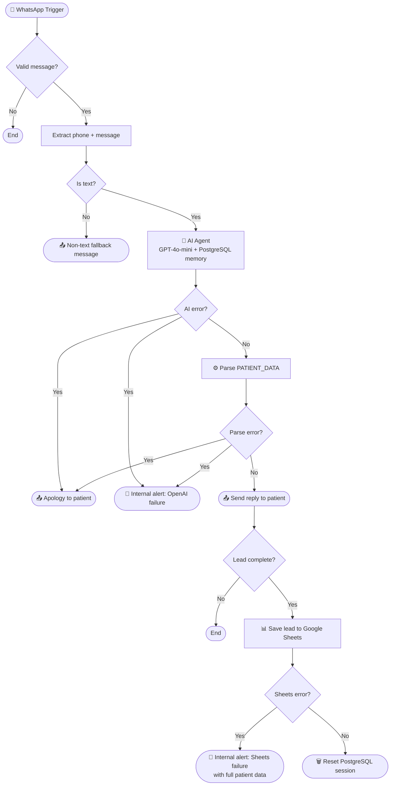

# ClinicBot — WhatsApp Conversational Agent for Private Clinics

> Automated patient intake and lead qualification via WhatsApp, built with n8n, GPT-4o-mini, and PostgreSQL.

---

## Overview

ClinicBot is a production-ready WhatsApp automation that handles inbound patient inquiries for private healthcare clinics. It answers frequently asked questions, qualifies patients by collecting key intake data, and escalates to a human agent when needed — all while maintaining conversation memory across sessions.

Built as a white-label proof of concept targeting the private healthcare sector in Argentina, ClinicBot is designed to be configurable and deployable for any clinic with a WhatsApp Business account.

---

## Tech Stack

| Layer | Technology |
|---|---|
| Automation engine | n8n (self-hosted) |
| Messaging | WhatsApp Business API (Meta) |
| AI model | GPT-4o-mini (OpenAI) |
| Conversation memory | PostgreSQL |
| Lead storage | Google Sheets |
| Runtime | Docker / VPS |

---

## Flow Architecture



---

## Core Features

**Patient FAQ handling**
Responds accurately to common inquiries: opening hours, specialties, location, insurance coverage, and pricing policy. Falls back to the clinic's phone number for anything outside its knowledge base.

**Lead qualification**
Collects four intake fields through natural conversation — no form-like behavior:
- Full name
- Reason for consultation
- Health insurance or self-pay
- Appointment type: urgent or scheduled

Once all four fields are collected, the agent generates a structured `PATIENT_DATA` block that the flow parses and stores in Google Sheets.

**Human escalation**
The agent escalates immediately when it detects emergency symptoms, requests to speak with a doctor, questions about ongoing treatments, or signs of emotional distress.

**Session memory**
Conversation context is stored per phone number in PostgreSQL with a 20-message window. Once a patient is fully qualified, the session is automatically reset so the next conversation starts clean.

---

## Fallback System

ClinicBot includes a five-layer fallback system designed for healthcare reliability — where silence is never an acceptable outcome.

| Scenario | Patient receives | Team receives |
|---|---|---|
| Non-text message (audio, image, etc.) | Friendly notice + clinic phone number | Nothing |
| OpenAI API failure | Apology + human handoff notice | WhatsApp alert with patient phone |
| Empty or malformed agent output | Apology + human handoff notice | WhatsApp alert with patient phone |
| PostgreSQL unavailable | Transparent — conversation continues without memory | Nothing |
| Google Sheets save failure | Nothing (patient already qualified) | WhatsApp alert with full patient data for manual entry |

**Implementation details:**
- AI Agent: `retryOnFail: true` (3 attempts, 1000ms wait), `onError: continueRegularOutput`
- Postgres Chat Memory: `onError: continueRegularOutput`
- Append row in sheet: `onError: continueRegularOutput`
- JavaScript parser: wrapped in `try/catch` with explicit `error` field in output
- All error branches checked via `If` nodes before proceeding

---

## White-Label Configuration

To deploy ClinicBot for a new clinic, replace the following values:

| Parameter | Location | Description |
|---|---|---|
| `systemMessage` | AI Agent node | Clinic name, address, hours, specialties, insurance list |
| `phoneNumberId` | All WhatsApp Send nodes | Meta Business phone number ID |
| `recipientPhoneNumber` (support) | Alert nodes (Send message3, Send message4) | Internal team WhatsApp number |
| `documentId` | Append row in sheet | Google Sheets document ID |
| Postgres credentials | Postgres Chat Memory + Execute SQL | Database connection |
| OpenAI credentials | OpenAI Chat Model | API key |
| WhatsApp credentials | All WhatsApp nodes | Meta Business API token |

---

## Installation

### Prerequisites
- n8n instance (self-hosted via Docker recommended)
- WhatsApp Business API account (Meta)
- OpenAI API key
- PostgreSQL database
- Google Sheets with the following headers in row 1:

```
FECHA | TELEFONO | NOMBRE | MOTIVO | OBRA SOCIAL | URGENCIA | RESUMEN
```

### Setup
1. Import `ClinicBot.json` into your n8n instance
2. Configure credentials for WhatsApp, OpenAI, PostgreSQL, and Google Sheets
3. Replace white-label values listed above
4. Activate the workflow
5. Point your Meta webhook to the n8n WhatsApp Trigger URL

---

## Project Context

ClinicBot is part of a healthcare automation portfolio developed under **Itera Digital Hub**. It is a white-label evolution of a production lead qualification agent originally built for a retail client, re-architected for the specific requirements of private healthcare: tone, compliance, emergency handling, and data reliability.

The project demonstrates applied AI agent design, structured output parsing, multi-layer error handling, and session lifecycle management in a real-world n8n workflow.

---

## Author

**Fabricio Rafael Garrido Guzmán**
Automation Developer — n8n · AI Agents · Workflow Integrations
[LinkedIn](https://www.linkedin.com/in/fabricio-garrido) · [GitHub](https://github.com/fabriciogarrido)
